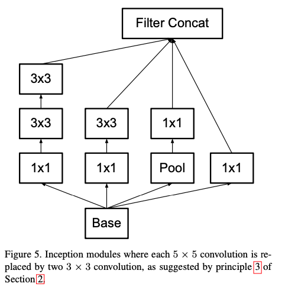

# Rethinking the Inception Architecture for Computer Vision (Inception-v2, v3)

### 0. Abstract

model size 를 늘리고, computational cost 를 늘리는 것이 성능 향상에는 좋지만,
computational efficiency 를 높이고, parameter 수를 줄이는 것은 여전히 mobile vision, big-data 처리를 가능하게 하는 요인이다.

저자는 **factorized convolution** 과 **aggressive regularization** 을 활용해 최대한 효율적으로 network 를 scale-up 하는 것을 목표로 한다.

### 1. Introduction

**AlexNet(2012)** 이 성공한 이후, 개선된 network 인  **VGGNet, GoogLeNet(2014)**  등이 많이 등장했다. 
흥미로운 점은 classifiaciton performance 가 개선되면, **computer vision** 의 다양한 분야도 함께 개선된다는 점이다. 

**VGGNet** 은 단순성이라는 강력한 기능을 가지고 있지만, 비용이 많이 든다.
반면, **GoogLeNet** 은 메모리와 computational budget 에 엄격한 제약 조건 속에서도 잘 동작하도록 설계되었다.
- GoogLeNet 은 AlexNet 에 비해 12배 적은 parameter 를 사용한다.
- VGGNet 은 AlexNet 보다 3배 더 많은 parameter 를 사용한다.

**Inception(GoogLeNet)** 아키텍처의 복잡성으로 인해 네트워크를 변경하기 어려워졌다.
성능을 키울 때, 단순히 scale-up 하는 것은 기존의 효율성을 잃는다. 그 예시로 단순히 filter size 를 2배로 늘리면 computational cost 와 parameter 는 4배로 증가한다. 또한, Inception 은 구조가 복잡해서 다양한 기법을 사용하면 더 복잡해진다.

따라서, 이 논문에서는 효율적인 방법으로 scaling-up 하는 몇가지 원칙과 최적화 아이디어를 소개한다.

### 2. General Design Principles

large-scale experimentation 을 기반으로 한 몇가지 design principels 를 소개한다.
이러한 원칙에서 크게 벗어나면 network 의 품질이 저하되는 경향이 있었고, 이것을 수정하면 일반적으로 아키텍처가 개선되었다.

1. **Avoid representational bottlenecks, especially early in the network.**
	-  Feed-forward network 는 정보 흐름의 방향을 제시한다.
	- extreme compression 을 통한 bottleneck 은 반드시 피해야한다.
	- representation size 는 입력에서 출력까지 **gently decrease** 되어야 한다.
	- 즉, feature map 을 급격하게 줄이지 말라는 의미로 해석할 수 있다. (feature map 을 급격하게 줄이면 정보 손실이 반드시 발생한다.)
2. **Higher dimensional representations are easier to process locally within a network**
	- 높은 차원의 표현이 network 내 지역적으로 처리하기 더 쉽다.
	- **activation** 횟수를 늘리면 feature 분리를 더 잘한다.
	- 그리고 이것이 학습 속도를 빠르게 한다.
3. **Spatial aggregation can be done over lower dimensional embeddings without much or any loss in representational power.**
	- spatial aggregation (conv 를 의미하는 것 같음) 을 할 때 차원 축소를 해도 representation power 손실 없이 lower dimensional embedding 을 할 수 있다.
	- conv 전 차원 축소를 해도 인접 unit 간 강한 상관관계로 인해 정보 손실을 줄여준다는 가설에 기반한 원칙이다.
	- conv 전 차원 축소는 학습 속도를 빠르게 한다.
4. **Balance the width and depth of the network.**
	- network 의 width & depth 를 늘리면 성능이 향상된다.
	- 최적의 improvement 를 위해서 parallel 하게 증가해야한다.
	- 따라서, computational budget 을 width 와 depth 에 균형있게 분배해야한다.

이러한 원칙은 모호한 상황에서 신중하게 적용했다.

### 3. Factorizing Convolutions with Larget Filter Size

가까운 activation 은 높은 상관관계를 가지고 있어 aggregation 전 activation 은 줄일 수 있고, 유사한 local representation 을 보여준다.
Inception network 는 fully convolutional 해서 각 weight 는 activation 당 하나의 연산이 있다. 따라서 컴퓨팅 비용을 줄이면 parameter 를 줄일 수 있다. 
또한, factorization 을 통해 더 구분되는 parameter 를 얻을 수 있고 빠른 학습이 가능하다.

#### 3.1 Factorization into smaller convolutions

5x5, 7x7 과 같은 넓은 필터를 가지는 convolution 은 계산 비용 측면에서 불균형적으로 비싼 경향이 있다.
5x5 는 3x3 filter 에 비해 25/9 만큼 비싸다.
넓은 필터가 초기 멀리 떨어진 유닛의 활성화 간 신호들의 의존성을 잘 찾아내기 때문에 필터의 기하학적 사이즈를 줄이는 것은 표현력의 큰 손실로 다가올 수 있다.

하지만, 논문에서 같은 input size 와 output depth 를 가지고 있으며 5x5 보다 적은 parameter 를 가지는 multi-layer 네트워크로 이를 대체할 수 있지 않겠냐고 말한다.

- 작은 fully-connected network 가 5x5 타일 위를 슬라이딩 하는 것처럼 보인다고 설명한다. 즉, 1개의 unit 이 아래 9개와 연결되어 있고 또 9개는 아래 25개의 unit 과 연결되어 있다.

- 논문에서 기존 5x5 필터를 3x3 2개로 이루어진 형태로 변환한다. 
	- 기존 모듈은 위 그림 좌측 3x3 2개의 층이 아닌 5x5 1개의 필터였다.
- 또한, 이 2개를 첫번째 필터는 3x3 convolution, 두번째 3x3 는 최상층과 연결된 fully-connected 층이라고 표현한다.
	- 변경된 모듈은 3번 원리 *(Spatial aggregation can be done over lower dimensional embeddings without much or any loss in representational power.)* 에 의해 변경되었다고 한다.

#### 3.2 Spatial Factorization into Asymmetric Convolutions

3x3 filter 보다 큰 filter 는 3x3 conv 여러개로 줄일 수 있기 때문에, 일반적으로 3x3 보다 큰 filter 는 유용하지 않다. 
그렇다면, 3x3 conv 는 2x2 conv 와 같이 더 줄일 수 있는가?
줄일 수 있지만, 그보다 nx1 과 같은 **asymmetric (비대칭) convolution** 이 더 낫다.

3x3 conv 는 1x3 conv 와 3x1 conv 로 대체될 수 있다. 그리고 parameter 는 33% 더 저렴하다. 계산 비용 역시 33% 절감된다.
2x2 conv 2개를 사용한 것과 비교하면, 2x2 conv 2개는 11% 밖에 절감하지 못한다.

이론상 Figure 6. 과 같이 어떤 nxn conv 도 1xn conv, nx1 conv 로 대체할 수 있다.
이것을 실제로 적용해보니, 초기 layer 에서는 잘 동작하지 않지만 적당한 grid-size (mxm feature map 에서 m 의 범위는 12~20 사이) 에서는 잘 작동한다. 그리고 그 레벨에서 1x7 conv, 7x1 conv 로 좋은 결과를 냈다.
- 초기 layer 에서는 공간의 일반적인 특징을 파악해야 하기 때문에 초반에 사용하는 것은 좋지 않은 것 같다.
- 3x3 conv 를 1x3, 3x1 conv 로 변환한 것과 같이 여러 번의 activation 을 통해 고수준의 feature 를 뽑아내는 것이지 않을까 생각한다.

### 4. Utility of Auxiliary Classifier

**auxiliary classifier** 는 gradient vanishing 문제에 대응하여 convergence 를 돕기 위해 사용되었다.

그러나, auxiliary classifier 가 학습 초기에는 수렴의 향상을 보이지 않는다는 것을 발견했다. 
- auxiliary classifier 가 없는 모델과 비교했을 때, 초반에는 비슷하고 후반에 그나마 조금 더 나은 결과를 보였다고 한다.
- 또한, GoogLeNet 에는 auxiliary classifier 2개를 사용했는데 낮은 곳에 있는 보조 분류기 1개를 삭제해도 network 의 퀄리티에는 큰 영향을 주지 않았다고 한다.
또한, auxiliary classifier 가 저수준의 특징을 발전시킨다는 가설은 틀렸다고 말한다.

대신 auxiliary classifier 가 **regularizer** 로써 작동한다고 말한다.
- BN or Dropout 이 있는 layer 에서 main classifier 가 더 잘 작동하기 때문이다.

### 5. Efficient Grid Size Reduction

k개의 채널을 가지는 d x d 그리드를 2k개의 채널을 가지는 (d/2) x (d/2) 그리드로 변경한다고 가정한다.
- stride 가 1인 convolution 을 적용한 후, pooling 을 한다.
	- 연산 비용이 2 * d^2 * k^2 가 된다.
- 만약 convolution 을 pooling 으로 대체한다면?
	- 연산 비용은 2 * (d/2)^2 * k^2 가 된다.

- 좌측은 표현의 축소가 급격하게 이루어져 1번 원칙을 위배한다.
- 우측은 좌측에 비해 연산량이 3배나 높다.

따라서, 위 그림과 같은 제안을 한다.
- 2개의 평행한 stride 2 block 을 사용한다.
- P와 C block 으로 지칭하며, P 는 pooling, C 는 convolution 이다.
- stride 는 2이며, 마지막에 concatenate 된다.
이러한 방법은 representation bottleneck 도 피하고, 1번 법칙을 위배하지도 않는다.

### 6. Inception-v2

Inception-v2 의 자세한 구조이다.

- 초기 7x7 conv 를 3x3 conv 로 factorize 했다.
- 또한, Inception 모듈 안에서만 zero-padding 을 했다.

- 위 모듈 3개를 사용했다.

- 다음으로 위 모듈 5개를 사용했다.
- 추가적으로 보조 분류기도 들어가는데, 초기 층보다 중간 층에서 더 잘 작동을 해 넣은 것 같다.

- 위 모듈은 2개 사용했다.
- 고차원의 표현력을 만들기 위함인 것 같다.

output 은 2048 개의 filter 로 concatenate 되었다.

### 7. Model Regularization via Lable Smootihng

**LSR (Lable Smoothing Regularization)** 을 적용해 정규화 과정을 추가했다.
- 2가지 문제를 방지하기 위해 제안한 매커니즘이다.
	- Overfitting 문제 : model 이 매 학습마다 ground-truth lable 에 full probability 를 할당하면 일반화 성능을 장담할 수 없다.
	- 이는 largetst logit 과 다른 것들의 차이를 크게 하고, 모델이 adapt 하는 능력을 떨어트린다.

예를 들어, **Lable Smoothing** 을 정답 라벨 [0, 1, 0, 0, 0] 에 적용한다고 했을 때, smoothing parameter 에 따라서 [0.1, 0.6, 0.1, 0.1, 0.1] 과 같이 적용하는 것이다.
model 이 lable 이 1인 한가지 상황에 집중하는 것보다 다양한 상황에 집중함으로써 일반화 성능이 좋아질 수 있다고 이해했다.

### 8. Training Methodology

학습 방법은 다음과 같다.
- Tensorflow 의 distributed machine learning system 으로 Kepler GPU 에서 50 replica 를 stochastic gradient 로 학습했다.
- batch size = 32 이고, epochs = 100 이다.
- weight decay = 0.9, 최고 성능은 RMSProp (decay=0.9, e=1.0) 으로 달성했다.
- learning rate = 0.045, 2 epoch 마다 0.94 의 비율로 지수적 감소
- 2.0 을 threshold 로 gradient clipping
- evaluation 은 parameter 의 running average 로

### 9. Performance on Lower Resolution Input

### 10. Experimental Results and Comparisons

논문에서 아래와 같이 **Inception-v3** 를 정의했다.
- Inceptionv2 + Auxiliary Classifier + RMSProp + Label Smoothing + Factorized 7×7

