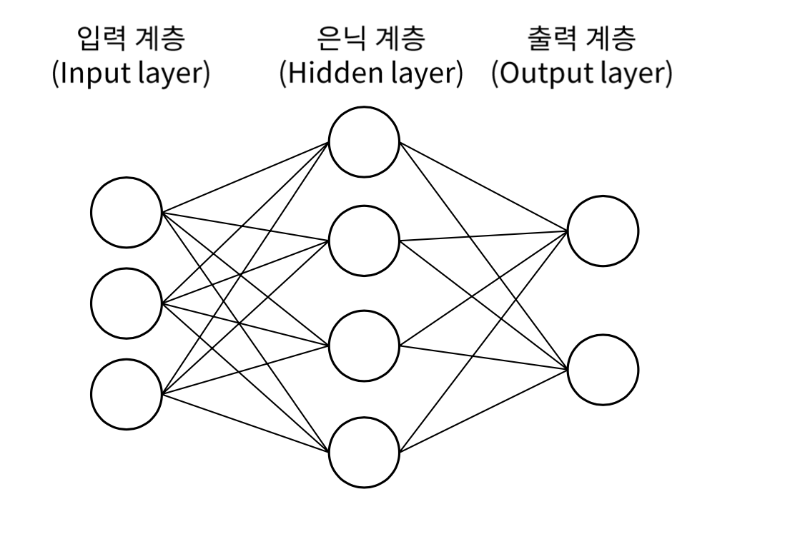

# 03. 신경망

### 1. 신경망



간단한 **신경망 (neural network)** 를 그림으로 표현하면 위와 같다.
뉴런이 연결되는 방식은 퍼셉트론과 동일하지만, 신호를 전달하는 방법에는 차이가 있다.

#### 활성화 함수의 등장

입력 신호의 총합을 출력 신호로 변환하는 함수를 일반적으로 **활성화 함수 (activation function)** 이라고 한다.
활성화 함수는 입력 신호의 총합이 활성화를 일으키는지 정하는 역할을 한다.

따라서, 어떠한 입력 신호가 주어졌을 때 뉴런에서는 다음과 같은 과정이 일어난다.
- 입력신호 x와 weight를 곱한 후, bias를 더한 결과 즉, **affine sum** 을 계산한다.
- 이를 **activation function** 에 통과시킨다.
활성화 함수가 퍼셉트론에서 신경망으로 가기 위한 길잡이 역할을 한다.

### 2. 활성화 함수

```python
def step_function(x):
	y = x > 0
	return y.astype(np.int)


def sigmoid(x):
	return 1 / (1 + np.exp(-x))


def relu(x):
	return np.maximum(0, x)
```

#### Step Function

퍼셉트론에서 뉴런은 뉴런에 전달된 신호에 가중치를 곱하고 편향을 더한 값이 0을 넘으면 1을 출력하고, 그렇지 않으면 0을 출력한다고 했다.
여기서 조건 분기의 동작을 함수로 표현한 `h(x)` 가 바로 **계단 함수 (step function)** 이다.

- **출력 범위** : 0 또는 1로 2가지 값으로 제한된다.
- **미분 가능성** : 불연속적이며 미분 불가능하다.
- **Vanishing Gradient** : 기울기가 0인 구간이 많기 때문에 기울기 소실 문제가 더욱 심화될 수 있다.
#### Sigmoid

**시그모이드 함수 (sigmoid function)** 은 신경망에서 자주 이용하는 활성화 함수이다.
입력 신호에 대해 `1 / (1 + np.exp(-x))` 를 한 출력을 돌려준다.

- **출력 범위** : 항상 0과 1 사이의 값을 출력한다.
- **미분 가능성** : sigmoid 는 연속적이며 미분 가능하다. 이러한 특징은 `backpropagation` 과 같은 기울기를 계산하는데 유용하다.
- **Vanishing Gradient** : 입력이 큰 경우 미분값이 매우 작아져 기울기가 소실될 수 있는 문제를 가지고 있다. 이로 인해 깊은 신경망에서 학습의 어려움으로 작용할 수 있다.

#### 비선형 함수

활성화 함수는 **비선형 함수** 를 사용해야 한다. 선형 함수를 사용한다면 신경망을 깊게 쌓는 의미가 없어지기 때문이다. 선형 함수의 문제점은 은닉층을 아무리 깊게 쌓아도 `은닉층이 없는 네트워크` 로 똑같이 대체할 수 있다는 것이다.

따라서, 신경망의 층을 깊게 쌓는 혜택을 얻고 싶다면 활성화 함수는 반드시 비선형 함수를 사용해야 한다.

#### ReLU

최근에는 **ReLU** 를 활성화 함수로 주로 이용한다.
ReLU는 입력이 0 이하면 0을 출력하고, 입력이 0 이상이면 입력을 그대로 출력한다.

- **계산 효율성** : ReLU는 입력이 양수인 경우 그대로 값을 출력해 계산이 간단하고 효율적이다. 따라서 깊은 신경망에서 학습 속도를 향상시킬 수 있다.
- **Vanishing Gradient** : 양수 영역에서 기울기가 항상 1이므로, 기울기 소실 문제가 발생하지 않는다.

### 3. MNIST

```python
import sys, os
sys.path.append(os.pardir)

import numpy as np
import pickle
from dataset.mnist import load_mnist
from common.functions import sigmoid, softmax


def get_data():
	(X_train, y_train), (X_test, y_test) = load_mnist(normalize=True,
											flatten=True, one_hot_label=False)
	return X_test, y_test

  
def init_network():
	with open("sample_weight.pkl", "rb") as f:
		network = pickle.load(f)
	return network


def predict(network, x):
	W1, W2, W3 = network['W1'], network['W2'], network['W3']
	b1, b2, b3 = network['b1'], network['b2'], network['b3']
	
	a1 = np.dot(x, W1) + b1
	z1 = sigmoid(a1)
	a2 = np.dot(z1, W2) + b2
	z2 = sigmoid(a2)
	a3 = np.dot(z2, W3) + b3
	y = softmax(a3)
	
	return y


# 신경망에 의한 추론
x, t = get_data()
network = init_network()

batch_size = 100
accuracy_cnt = 0

for i in range(0, len(x), batch_size):
	x_batch = x[i: i+batch_size]
	y_batch = predict(network, x_batch)
	p = np.argmax(y_batch, axis=1)
	accuracy_cnt += np.sum(p == t[i: i+batch_size])
	
# 정확도 출력
print("Accuracy: " + str(float(accuracy_cnt) / len(x)))
```

**MNIST** 데이터셋을 이용해 학습과정은 생략하고 추론 과정만 구현한 코드이다. `sample_weight.pkl` 파일을 이용해 학습된 가중치 매개변수를 이용한다. 이러한 추론의 과정을 **forward** 라고 한다.

### 정리

- 신경망에서는 활성화 함수로 시그모이드 함수와 ReLU 함수 같은 매끄럽게 변화하는 함수를 이용한다.
- numpy의 다차원 배열을 잘 사용하면 신경망을 효율적으로 구현할 수 있다.
- 기계학습 문제는 크게 regression, classification 문제로 나눌 수 있다.
- 출력층의 활성화 함수로는 회귀에서는 주로 항등 함수, 분류에서는 주로 Softmax 함수를 이용한다.
- 분류에서 출력층의 뉴런 수를 분류하려는 클래스 수와 같게 설정한다.
- 입력 데이터를 묶은 것을 배치라 하며, 추론 처리를 이 배치 단위로 진행하면 결과를 훨씬 빠르게 얻을 수 있다.
