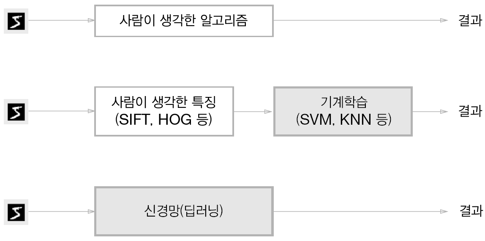
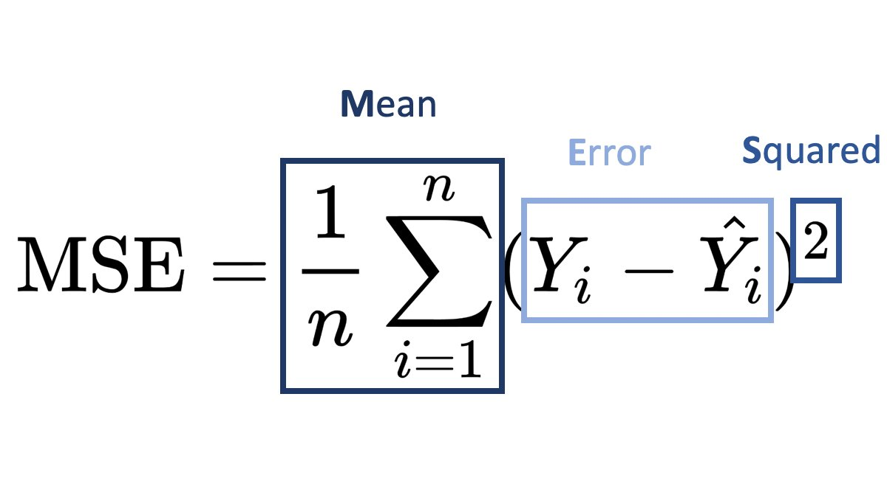
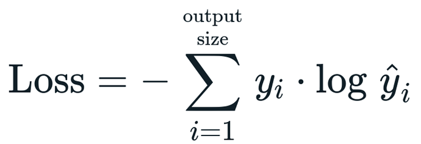
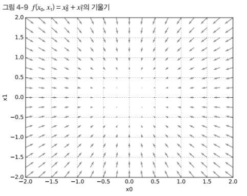
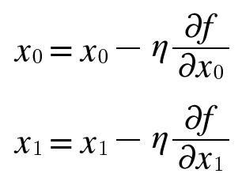

# 04. 신경망 학습

4장의 주제는 신경망 학습이다. **학습**이란, 훈련 데이터로부터 가중치 매개변수의 최적값을 자동으로 획득하는 것을 뜻한다. 이번 장에서는 신경망이 학습할 수 있도록 해주는 **지표**인 손실 함수를 소개한다. **손실 함수**의 결과값을 가장 작게 만드는 가중치 매개변수를 찾는 것이 학습의 목표이다.

### 1. 데이터에서 학습한다!
#### 1.1 데이터 주도 학습

기계학습의 중심에는 **데이터**가 존재한다. 데이터에서 답을 찾고 데이터에서 패턴을 발견하고 데이터로 이야기를 만드는 것이 기계학습이다. 데이터가 이끄는 접근 방식 덕에 사람 중심 접근에서 벗어날 수 있다.



- 규칙을 `사람` 이 만드는 방식에서 `기계` 가 `데이터` 로부터 배우는 방식으로의 패러다임 전환

위 그림과 같이 MNIST 데이터의 5를 인식하는 프로그램을 설계하려면 어떻게 해야할까?

- **사람**은 5를 어렵지 않게 인식할 수 있지만, 그 안에 숨은 규칙성을 명확한 로직으로 풀어내는 것은 만만치 않을 것이다.
- **기계 학습**은 이미지에서 **특징**을 추출하고 그 특징의 패턴을 학습한다. 이때, 적절한 특징은 사람이 생각해내야 한다.
- **신경망 (딥러닝)** 은 사람이 개입하지 않고 이미지를 있는 그대로 학습한다. 사람이 찾아야하는 적절한 특징을 스스로 학습한다. 이러한 이유로 인해 딥러닝을 `종단간 기계학습 (end-to-end machine learning)` 이라고도 한다.

#### 1.2 훈련 데이터와 시험 데이터

데이터를 **훈련 데이터**와 **시험 데이터**로 나눠 모델을 학습하는 이유가 무엇일까?

아직 보지 못한 데이터에 대해 올바르게 문제를 풀어내는 **범용 능력**이 높은 모델을 설계하기 위해서다. 데이터셋 하나로만 매개변수의 학습과 평가를 수행하면 올바른 평가가 될 수 없다. 한 데이터셋에만 지나치게 최적화된 상태를 **오버피팅 (overfitting)** 이라고 하며,  오버피팅을 피하는 것은 기계학습의 중요한 과제이기도 하다.

### 2. 손실 함수

신경망 학습에서 사용하는 지표는 **손실 함수(loss function)** 라고 한다. 손실 함수는 임의의 함수를 사용할 수도 있지만 일반적으로 `MSE(Mean Squared Error)` 와 `CEE(Cross Entropy Error` 를 사용한다.

#### 2.1 평균 제곱 오차 : MSE



가장 많이 쓰이는 손실 함수는 **평균 제곱 오차 (MSE, Mean Squared Error)** 이다.
모델의 출력 즉, 예측값과 실제 레이블 값의 차를 제곱한 것들의 평균이다. 이 값이 작을수록 정답에 더 가까울 것으로 판단할 수 있다.

#### 2.2 교차 엔트로피 오차 : CEE



또 다른 손실 함수로서 **교차 엔트로피 오차 (CEE, Cross Entropy Error)** 도 자주 이용한다.
정답 레이블은 정답 원소의 값만 1이고 나머지는 0이므로, 정답일 때의 모델의 예측값이 전체 값을 정하게 된다. 즉, 예측값이 0.6이라면, `-log0.6` 이다.

자연 로그의 그래프는 x가 1에 가까워질수록 y값이 작아진다. `MSE` 와 마찬가지로 오차 값이 더 작을수록 정답일 가능성이 높다고 판단한다.

#### 2.3 미니배치 학습

기계학습 문제는 훈련 데이터를 사용해 학습한다. 그렇기 때문에 모든 훈련 데이터를 대상으로 손실 함수 값을 구해야 한다. 하지만, 모든 데이터를 대상으로 손실 함수의 값을 구하는 것은 현실적이지 않으므로, 데이터 일부를 추려 전체의 **근사치**로 이용할 수 있다. 데이터의 일부를 **미니배치**라고 한다. 

#### 2.4 왜 손실 함수를 설정하는가?

우리의 궁극적인 목표는 **정확도**를 높이는 매개변수 값을 찾는 것이다. 하지만, 정확도라는 지표를 두고 손실 함수의 값이라는 우회적인 방법을 택하는 이유는 무엇일까?

결론은 `정확도를 지표로 하면 매개변수의 미분이 대부분의 장소에서 0이 되기 때문에 손실 함수의 값을 지표로 삼는다.` 
즉, 신경망 학습은 최적의 매개변수를 탐색할 때 손실 함수의 값을 가능한 작게 하는 매개변수 값을 찾는다. 이때 매개변수의 기울기를 계산하고 그것을 단서로 매개변수의 값을 서서히 갱신한다. 

만약 정확도를 지표로 매개변수 값을 갱신한다면 매개변수를 약간만 조정해서는 정확도가 개선되지 않고 일정하게 유지될 것이다. 즉, 값이 불연속적으로 갑자기 변화한다. 활성화 함수로 계단 함수를 사용하지 않는 이유와 들어맞다.

### 3. 수치 미분

#### 3.1 미분

미분은 한순간의 변화량을 표시한 것이다. 즉, x의 작은 변화가 함수 f(x)를 얼마나 변화시키느냐를 의미한다.
미분을 단순하게 파이썬으로 구현하면 다음과 같이 계산할 수 있다.

```python
def numerical_diff(f, x):
	h = 10e-50
	return (f(x + h) - f(x)) / h
```

- 하지만 이 방식은 2가지 개선점이 있다.

먼저, `h = 10e-50` 의 값이 반올림 오차 문제를 일으키기 때문에 미세한 값을 `h = 1e-4` 로 개선할 수 있다. 이 정도의 값을 이용하면 좋은 결과를 얻는다고 알려져 있다.

두번째는 함수 f의 차분과 관련된 것이다. `f(x + h) - f(x)` 즉, 함수 f의 차분을 계산하고 있지만 오차가 있다는 사실에 주의해야 한다. **진정한 미분**은 `x 위치의 함수의 기울기` 이지만, 위에서 구현한 것은 일치하지 않는다. h를 무한히 0으로 좁히는 것이 불가능해 생기는 한계이다. 따라서, 이 오차를 줄이기 위해 `f(x+h) - f(x-h)` 즉, 중심 차분을 계산하는 방법을 쓰기도 한다.

#### 3.2 편미분

**편미분**은 변수가 여럿인 함수에 대한 미분을 말한다. 
변수가 하나인 미분과 마찬가지로 특정 장소의 기울기를 구한다. 하지만, 여러 변수 중 목표 변수 하나에 초점을 맞추고 다른 변수는 값을 고정한다.

### 4. 기울기

모든 변수의 편미분을 벡터로 정리한 것을 **기울기 (gradient)** 라고 한다.
기울기는 예를 들어 다음과 같이 구현할 수 있다.

```python
def numerical_gradient(f, x):
	h = 1e-4
	grad = np.zeros_like(x)

	for idx in range(x.size):
		tmp_val = x[idx]
		# f(x+h) 계산
		x[idx] = tmp_val + h
		fxh1 = f(x)
		
		# f(x-h) 계산
	x[idx] = tmp_val - h
	fxh2 = f(x)

	grad[idx] = (fxh1 - fxh2) / (2*h)
	x[idx] = tmp_val

	return grad
```

기울기의 결과에 마이너스를 붙인 벡터를 그래프로 그리면 다음과 같다.



기울기는 각 지점에서 낮아지는 방향을 가리킨다.
더 정확히 말하면 **기울기가 가리키는 쪽은 각 장소에서 함수의 출력 값을 가장 크게 줄이는 방향**이다.

#### 4.1 경사법 (경사 하강법)

기계학습 문제 대부분은 학습 단계에서 최적의 매개변수를 찾아낸다.
신경망 역시 최적의 매개변수(가중치와 편향)를 학습 시에 찾아야 한다.

하지만, 일반적인 문제의 손실 함수는 매우 복잡하다. 매개변수 공간이 광대하여 어디가 최솟값이 되는 곳인지를 짐작할 수 없다.

이런 상황에서 기울기를 잘 이용해 함수의 최솟값(또는 가능한 한 작은 값)을 찾으려는 것이 **경사법**이다.



경사법을 수식으로 나타내면 위와 같다.
여기서 η 기호는 갱신하는 양을 나타내며 이를 **학습률 (learning rate)** 라고 한다.
- 한 번의 학습으로 얼만큼 학습해야 할지, 매개변수 값을 얼마나 갱신할지 정하는 것이다.
- Learning Rate는 `0.01 or 0.001` 과 같이 미리 정해두는데, 일반적으로 값이 너무 크거나 작으면 Global Minima를 찾아갈 수 없다.

#### 4.2 신경망에서 기울기

신경망 학습에서도 기울기를 구해야하는데, 여기서 말하는 기울기는 가중치 매개변수에 대한 손실 함수의 기울기이다.

간단한 신경망을 예로 들어 기울기를 구하는 코드를 구현해 본다.

```python
import sys, os
sys.path.append(os.pardir)
import numpy as np
from common.functions import softmax, cross_entropy_error
from common.gradient import numerical_gradient


class simpleNet:
	def __init__(self):
		self.W = np.random.randn(2, 3)

	def predict(self, x):
		return np.dot(x, self.W)

	def loss(self, x, t):
		z = self.predict(x)
		y = softmax(z)
		loss = cross_entropy_error(y, t)
		
		return loss

x = np.array([0.6, 0.9])
t = np.array([0, 0, 1])

net = simpleNet()

f = lambda w: net.loss(x, t)
dW = numerical_gradient(f, net.W)

print(dW)
```

- 예측을 하는 `predict(self, x)` 와 손실 함수의 값을 계산하는 `loss(self, x, t)` 가 있다.
- 여기서 `x` 는 입력 데이터, `t` 는 정답 레이블이다.

신경망의 기울기를 구한 후에는 경사법에 따라 가중치 매개변수를 갱신하면 된다.

### 5. 학습 알고리즘 구현하기

신경망의 학습 절차는 다음과 같다.

**전제**
- 신경망에는 적응 가능한 가중치와 편향이 있고, 이 가중치와 편향을 훈련 데이터에 적응하도록 조정하는 과정을 `학습` 이라고 한다.

**1단계 : 미니배치**
-  훈련 데이터 중 일부를 무작위로 가져온다. 
- 선별한 데이터를 `미니배치` 라고 하며 미니배치의 손실 함수 값을 줄이는 것이 목표이다.

**2단계 : 기울기 산출**
- 각 가중치 매개변수의 기울기를 구한다.
- 기울기는 손실 함수의 값을 가장 작게 하는 방향을 제시한다.

**3단계 : 매개변수 갱신**
- 가중치 매개변수를 기울기 방향으로 아주 조금 갱신한다.

**4단계 : 반복**
- 1~3단계를 반복한다.

매개변수를 갱신할 때 `경사 하강법` 을 이용하며 데이터를 무작위로 선정하기 때문에 **확률적 경사 하강법 (SGD, Stochastic Gradient Descent)** 라고 부른다.

구현한 코드는 [코드 바로가기](https://github.com/BBOXEEEE/ML-DL-study/tree/master/%EB%B0%91%EB%B0%94%EB%8B%A5%EB%B6%80%ED%84%B0%20%EC%8B%9C%EC%9E%91%ED%95%98%EB%8A%94%20%EB%94%A5%EB%9F%AC%EB%8B%9D/code/Chapter04) 를 참고!
### 정리

- 기계학습에서 사용하는 데이터셋은 훈련 데이터와 시험 데이터로 나눠 사용한다.
- 훈련 데이터로 학습한 모델의 범용 능력을 시험 데이터로 평가한다.
- 신경망 학습은 손실 함수를 지표로 손실 함수의 값이 작아지는 방향으로 가중치 매개변수를 갱신한다.
- 가중치 매개변수를 갱신할 때는 가중치 매개변수의 기울기를 이용하고 기울어진 방향으로 가중치의 값을 갱신하는 작업을 반복한다.
- 아주 작은 값을 주었을 때의 차분으로 미분하는 것을 수치 미분이라고 한다.
- 수치 미분을 이용해 가중치 매개변수의 기울기를 구할 수 있다.
- 수치 미분을 이용한 계산에는 시간이 걸리지만, 그 구현은 간단하다. 한편, 오차역전파법을 이용하면 기울기를 고속으로 구할 수 있다.
